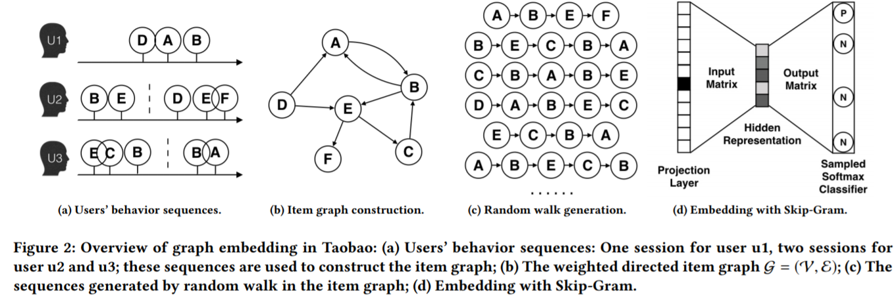

# EGES

### Introduction

这篇文章主要回顾和介绍2018年Alibaba在KDD里面提出的的**EGES(Enhanced Graph Embedding with Side information)** 模型。 这个模型主要是在DeepWalk 学习到embedding的基础上增添了其他item的补充信息(side inforamtion). 在介绍EGES之前，先介绍一下过去Item2Vec以及DeepWalk 学习item的embedding的特点以及一些不足。 之后再介绍EGES的思路和训练方法。  $$BELoss = \sum_i^n y_i log(p_i) + (1- y_i)log(1- p_i)$$&#x20;

### Item2Vec

### DeepWalk

.png>)

### Graph Embedding

#### Motivation

#### Basic Graph Embedding (BGE)

#### Graph Embedding with Side information (BES)

#### Enhanced Graph Embedding with Side information (EBES)

### Reference

\[1] Alibaba-EGES: [https://arxiv.org/pdf/1803.02349v2.pdf](https://arxiv.org/pdf/1803.02349v2.pdf) \[2] DeepWalk： [https://arxiv.org/pdf/1403.6652.pdf](https://arxiv.org/pdf/1403.6652.pdf) \[3]
