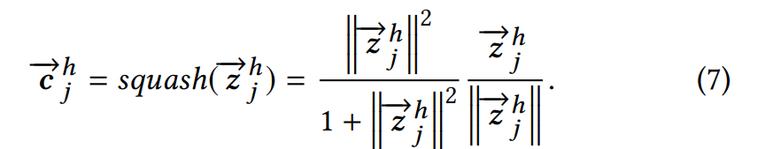

# 召回 - MIND

## 目标

*   MIND - Multi-Interest Network with Dynamic routing

    通过构建多种类的用户表征向量来捕捉用户不同类型的兴趣， 比如不同类目商品（衣服， 零食，电器等等）， 弥补过去电商用单个用户向量捕捉用户信息不足的缺点

## 改动点

* 基于胶囊网路(Capsule Network)和动态路由(Dynamic Routing)设计Multi-Interest Extractor  对用户不同兴趣进行聚类得到多种兴趣信息
* 设计label-aware attention 辅助用户多兴趣向量学习

## 思路

*   问题定义：

    <figure><figcaption></figcaption></figure>

    * $$P_u , I_u , F_i$$  分别代表用户画像属性特征， 用户行为序列特征， item商品的特征(可以是id 或其他连续离散统计值)
    * $$Vu = (v^1_u, v^2_u, ..v^k_u) = f_{user}(I_u, P_u)$$ 代表用户信息聚合后的多目标兴趣向量列表， $$v^i_u$$ 代表第i个兴趣向量。
    * $$e^i =f(F_i)$$ 代表第i个商品向量
    * 优化目标 $$f_{score} (V_u , e_i)= \max(v^k_u, e^i)$$ 让第i 个商品向量和用户第k个商品兴趣向量相似度打分最大化

* Dynaimc Routing 参数更新
  *   个人认为B2I dynamic routing 的思想和attention思想差不多，也是

      * 算user emb uj和item embedding ei 的相似度 bij 和 对应的softmax 分wij
      * 然后用这个相似度分和通过矩阵S映射到同一空间的item emb 做weight sum&#x20;
      * 再通过squeeze 函数做非线性变换 (个人认为这squeeze非线性变化也可以理解成对emb的norm)
      * 然后重复多次K 次计算把每个兴趣都遍历算得到最终的embedding

  *   计算步骤

      *   定义：

          * &#x20;$$e_i$$ 第i个商品向量，对应一个商品embedding矩阵的第i行.&#x20;
          * &#x20;$$u_j$$ 第j个兴趣胶囊 的向量 (uj 向量有ei, S, bij 这些参数变量计算得到， 没有自己独立变量).&#x20;
          * &#x20;$$b_{ij}$$  为第i个商品向量和第j个兴趣胶囊向量之间的相似度，bij会作为一个变量存放到一个矩阵里面。
          *   &#x20;S 是一个映射矩阵把商品行为序列向量ei 和胶囊uj向量映射到同一个空间。

      * 步骤：
        * 初始化变量item 向量矩阵， 矩阵S， 相似度矩阵B, bij 对应B的第i行第j列的变量
        * 把第i行的相似度矩阵bij 做softmax 得 第i个商品和第j个兴趣胶囊相似度 wij
        * 计算第j个胶囊向量中间态： $$z_j = \sum_i w_{ij} S e_i$$
        * 第j个兴趣胶囊向量： $$u_j = squash(z_j)$$
        * 用新的uj, ei 更新当前胶囊的bij： $$b_{ij}=b_{ij} + u_j S e_i$$&#x20;
        *   遍历每个胶囊j， 即 K 次 得到K个胶囊向量

      <figure><figcaption></figcaption></figure>
*

<figure><figcaption></figcaption></figure>

## 优缺点




